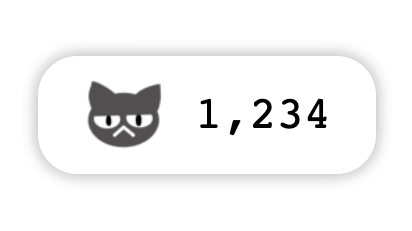

# i-like-this-page

<div align="center">
  
</div>

It's a **widget** that allows visitors to mark "_LIKE_" on your page.

## How to use

### Get `i-like-this-page` script

```html
<script src="https://iltp.link/bundle/iltp.bundle.min.js"></script>
```

### Insert `<div>` where you want

```html
<div id="i-like-this-page"></div>
```

## Usage example

There is a widget at the bottom of [my blog post](https://minho-jang.github.io/development/18/).
